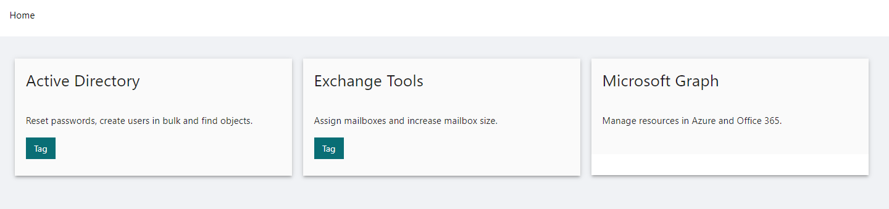

# PowerShell Universal Landing Page

A dashboard that automatically generates a landing page based on the dashboards defined in your environment. Only dashboards that a user has access to will be displayed. 

## Usage

Change the Base URL of the Landing Page dashboard to `/` to set it as the default route.